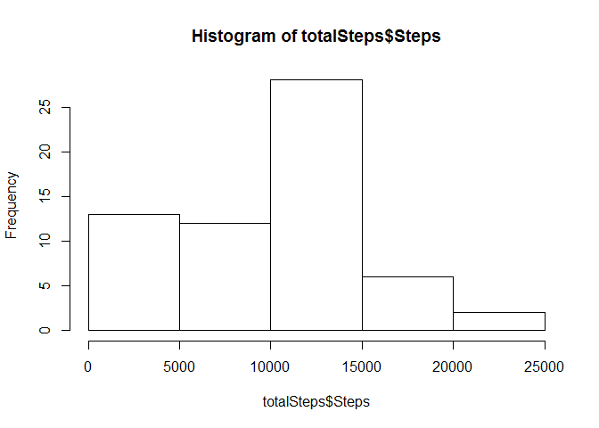
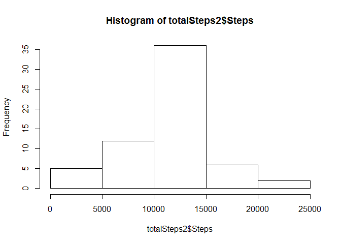
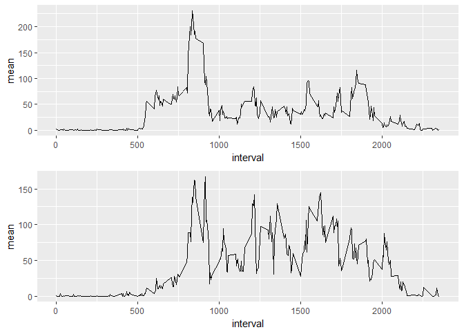

## Reproducible Research - Assignment: Course Project 1


Loading and preprocessing the data

```r
unzip("activity.zip")
activity <-  read.csv("activity.csv")
```
Transforming the data into a format suitable for analysis


```r
activity$date <- as.Date(activity$date)
```

Calculating the total number of steps taken per day

```r
totalSteps <- aggregate(x = activity$steps, by = list(activity$date), FUN = sum, na.rm = TRUE)
names(totalSteps) <- c("Date", "Steps")
```

Making a histogram of the total number of steps taken each day

```r
hist(totalSteps$Steps)
```

<!-- -->

Tthe mean of the total number of steps taken per day is 

```r
mean(totalSteps$Steps)
```

```
## [1] 9354.23
```

The median of the total number of steps taken per day is  

```r
median(totalSteps$Steps)
```

```
## [1] 10395
```


Making a time series plot of the 5-minute interval (x-axis) and the average number of steps taken, averaged across all days (y-axis)

```r
stepsInFiveMinutes <- aggregate(activity$steps, by = list(activity$interval), FUN = mean, na.rm = TRUE)
names(stepsInFiveMinutes) <- c("interval", "mean")

plot(stepsInFiveMinutes, type = "l")
```

<!-- -->

The 5-minute interval, on average across all the days in the dataset, contains the maximum number of steps is

```r
stepsInFiveMinutes[rev(order(stepsInFiveMinutes$mean))[1],1]
```

```
## [1] 835
```

The total number of missing values in the dataset is 

```r
sum(is.na(activity$steps))
```

```
## [1] 2304
```

Using the mean of the steps, averaged by 5-minutes interval, for filling in all of the missing values in the dataset

```r
activity2 <- activity

for(i in 1:nrow(activity2)) {
  if(is.na(activity2[i, 1])) {
    activity2[i, 1] <- stepsInFiveMinutes[which(stepsInFiveMinutes$interval == activity2[i, 3]), 2]
  }
}
```

Making a histogram with new dataset

```r
totalSteps2 <- aggregate(x = activity2$steps, by = list(activity2$date), FUN = sum, na.rm = TRUE)
names(totalSteps2) <- c("Date", "Steps")

hist(totalSteps2$Steps)
```

<!-- -->

Ploting comparing the average number of steps taken per 5minute interval across weekdays and weekends

```r
activity2$week <- ifelse(weekdays(activity2$date) %in% c("sábado", "domingo"), "weekend", "weekday")

library(ggplot2)
library(ggpubr)
```

```
## Warning: package 'ggpubr' was built under R version 3.4.2
```

```
## Loading required package: magrittr
```

```r
activity2weekdays <- subset(activity2, activity2$week == "weekday")
activity2weekends <- subset(activity2, activity2$week == "weekend")

stepsInFiveMinuteswd <- aggregate(activity2weekdays$steps, by = list(activity2weekdays$interval), FUN = mean, na.rm = TRUE)
names(stepsInFiveMinuteswd) <- c("interval", "mean")
plot1 <- ggplot(stepsInFiveMinuteswd, aes(x = interval, y = mean)) + geom_line()

stepsInFiveMinuteswe <- aggregate(activity2weekends$steps, by = list(activity2weekends$interval), FUN = mean, na.rm = TRUE)
names(stepsInFiveMinuteswe) <- c("interval", "mean")
plot2 <- ggplot(stepsInFiveMinuteswe, aes(x = interval, y = mean)) + geom_line()

ggarrange(plot1, plot2, ncol = 1, nrow = 2)
```

<!-- -->

